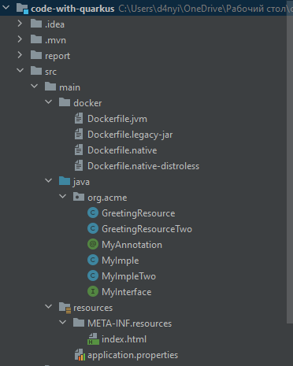
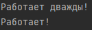
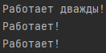
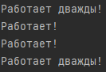

= Отчет по лабораторной работе 5
Студента группы ПИМ-21 Петров Д.Д.
:figure-caption: Рисунок
:listing-caption: Листинг
:source-highlighter: coderay

== 1 Постановка задачи
В процессе выполнения лабораторной работы необходимо выполнить следующие задачи:

. Реализовать интерфейс, для которого предусмотрено внедрение зависимостей.
. Сделать несколько реализаций этого интерфейса в рамках контейнера.
. Показать все доступные реализации этого интерфейса.

== 2 Выполнение

=== 2.1 Структура проекта

.Структура проекта

=== 2.2 Задание
Интерфейс MyInterface

.Листинг интерфейса MyInterface.
[source, java]
----
package org.acme;

public interface MyInterface {
    void draw();
}
----

.Первая реализация интерфейса MyInterface.
[source, java]
----
package org.acme;

import javax.enterprise.context.ApplicationScoped;

@ApplicationScoped
public class MyImple implements MyInterface {

    @Override
    public void draw() {
        System.out.println("Работает!");
    }
}
----

.Вторая реализация интерфейса MyInterface.
[source, java]
----
package org.acme;

import javax.enterprise.context.ApplicationScoped;

@ApplicationScoped
@MyAnnotation
public class MyImpleTwo implements MyInterface {

    @Override
    public void draw() {
        System.out.println("Работает дважды!");
    }
}
----

.Вторая реализация интерфейса MyInterface.
[source, java]
----
package org.acme;

import javax.enterprise.context.ApplicationScoped;

@ApplicationScoped
@MyAnnotation
public class MyImpleTwo implements MyInterface {

    @Override
    public void draw() {
        System.out.println("Работает дважды!");
    }
}
----

В нашем случае присутствует 2 реализации интерфейса. Используем аннотацию MyAnnotation.
Данный способ поможет нам устранить неоднозначность использования реализации MyInterface.

.Аннотация MyAnnotation.
[source, java]
----
package org.acme;

import javax.inject.Qualifier;
import java.lang.annotation.Retention;
import java.lang.annotation.Target;

import static java.lang.annotation.ElementType.*;
import static java.lang.annotation.RetentionPolicy.RUNTIME;

@Qualifier
@Retention(RUNTIME)
@Target({METHOD, FIELD, PARAMETER, TYPE})
public @interface MyAnnotation {}
----

.Аннотация MyAnnotation.
[source, java]
----
package org.acme;

import javax.inject.Qualifier;
import java.lang.annotation.Retention;
import java.lang.annotation.Target;

import static java.lang.annotation.ElementType.*;
import static java.lang.annotation.RetentionPolicy.RUNTIME;

@Qualifier
@Retention(RUNTIME)
@Target({METHOD, FIELD, PARAMETER, TYPE})
public @interface MyAnnotation {}
----

.Класс GreetingResourceTwo.
[source, java]
----
@Path("/hello")
public class GreetingResourceTwo {

    @Inject
    @MyAnnotation
    MyInterface myInterface;

    @Inject
    @Any
    Instance<MyInterface> instanceNew;

    @GET
    @Produces(MediaType.TEXT_PLAIN)
    public String hello() {
        for (MyInterface m : instanceNew) {
            m.draw();
        }
        return "Hello RESTEasy";
    }

    @GET
    @Path("1")
    @Produces(MediaType.TEXT_PLAIN)
    public String hello1() {
        for (MyInterface m : instanceNew) {
            if (m instanceof MyImple)
                m.draw();
        }
        return "Привет";
    }

    @GET
    @Path("2")
    @Produces(MediaType.TEXT_PLAIN)
    public String hello2() {
        for (MyInterface m : instanceNew) {
            if (m instanceof MyImpleTwo)
                m.draw();
        }
        return "Пока";
    }
}
----

== 3 Результаты выполнения
В качестве результата работы приложены соответствующие скриншоты.

.Перейдем на 'http://localhost:8080/hello' и посмотрим на результат в консоли

.Перейдем на 'http://localhost:8080/hello/1' и увидим вывод слова 'Работает!'

.Перейдем на 'http://localhost:8080/hello/2' и увидим вывод слова 'Работает дважды!'

== Вывод
В результате выполнения лабораторной работы, мы попрактиковались в работе с quarkus. В итоге, был реализован интерфейс MyInterface и несколько его реализации, которые в итоге были продемонстрированны.
