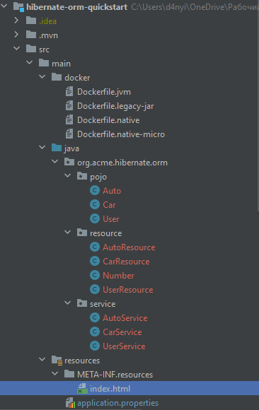
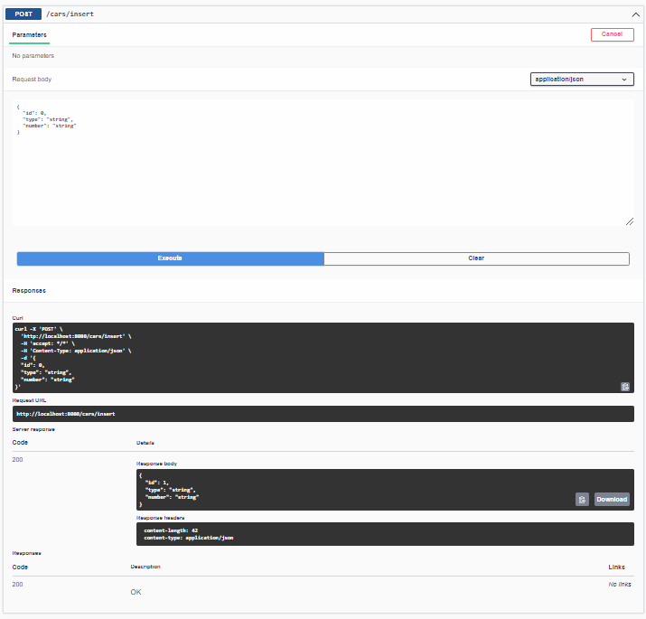
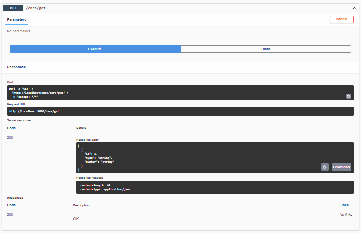
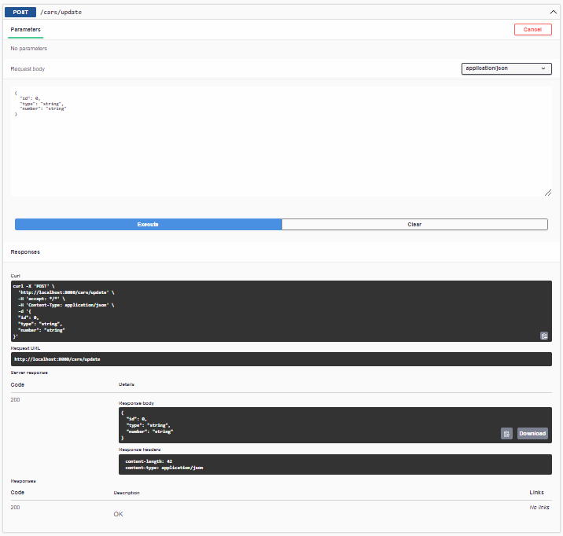

= Отчет по лабораторной работе 6
Студента группы ПИМ-21 Петров Д.Д.
:figure-caption: Рисунок
:listing-caption: Листинг
:source-highlighter: coderay

== 1 Постановка задачи
В процессе выполнения лабораторной работы необходимо выполнить следующие задачи:

. Реализовать три сущности.
. Реализовать CRUD операции для каждой сущности.

== 2 Выполнение

=== 2.1 Структура проекта

.Структура проекта

=== 2.2 Задание
Былы разработаны сущности: Car, Auto, User.

.Листинг класса User.
[source, java]
----
package org.acme.hibernate.orm.pojo;

import javax.persistence.*;

@Entity
@Table(name = "users")
public class User {

    @Id
    @GeneratedValue(strategy = GenerationType.IDENTITY)
    private int id;
    @Column(name = "name")
    private String name;

    private int age;

    public User() {
    }

    public User(String name, int age) {
        this.name = name;
        this.age = age;
    }

    public int getId() {
        return id;
    }

    public String getName() {
        return name;
    }

    public void setName(String name) {
        this.name = name;
    }

    public int getAge() {
        return age;
    }

    public void setAge(int age) {
        this.age = age;
    }

    @Override
    public String toString() {
        return "models.User{" +
                "id=" + id +
                ", name='" + name + '\'' +
                ", age=" + age +
                '}';
    }

}
----

.Листинг класса Car.
[source, java]
----
package org.acme.hibernate.orm.pojo;

import javax.persistence.*;

@Entity
@Table(name = "сar")
public class Car {

    @Id
    @GeneratedValue(strategy = GenerationType.IDENTITY)
    private int id;

    @Column(name = "type")
    private String type;
    //можно не указывать Column name, если оно совпадает с названием столбца в таблице
    @Column(name = "number")
    private String number;

    public Car() {
    }

    public Car(String type, String number) {
        this.type = type;
        this.number = number;
    }

    public int getId() {
        return id;
    }

    public String getType() {
        return type;
    }

    public void setType(String type) {
        this.type = type;
    }

    public String getNumber() {
        return number;
    }

    public void setNumber(String number) {
        this.number = number;
    }

    @Override
    public String toString() {
        return "models.Car{" +
                "id=" + id +
                ", type='" + type + '\'' +
                ", number=" + number +
                '}';
    }

}
----

.Листинг класса Auto.
[source, java]
----
package org.acme.hibernate.orm.pojo;

import javax.persistence.*;

@Entity
@Table(name = "autos")
public class Auto {

    @Id
    @GeneratedValue(strategy = GenerationType.IDENTITY)
    private int id;

    @Column (name = "model")
    private String model;

    private String color;

    @ManyToOne(fetch = FetchType.LAZY)
    @JoinColumn(name = "user_id")
    private User user;

    public Auto() {
    }

    public Auto(String model, String color) {
        this.model = model;
        this.color = color;
    }

    public int getId() {
        return id;
    }

    public String getModel() {
        return model;
    }

    public void setModel(String model) {
        this.model = model;
    }

    public String getColor() {
        return color;
    }

    public void setColor(String color) {
        this.color = color;
    }

    public User getUser() {
        return user;
    }

    public void setUser(User user) {
        this.user = user;
    }

    @Override
    public String toString() {
        return color + " " + model;
    }

}
----

Далее были поддержаны следующие операции для каждой сущности:

. Создание.
. Получение.
. Замена.
. Удаление.

.Листинг классса UserResource
[source, java]
----
package org.acme.hibernate.orm.resource;

import org.acme.hibernate.orm.pojo.User;
import org.acme.hibernate.orm.service.UserService;

import javax.inject.Inject;
import javax.ws.rs.*;
import javax.ws.rs.core.MediaType;
import javax.ws.rs.core.Response;

@Path("/user")
public class UserResource {

    @Inject
    UserService userService;

    @GET
    @Produces(MediaType.APPLICATION_JSON)
    @Path("/get")
    public Response getUsers() {
        return Response.ok(userService.getUser()).build();
    }

    @GET
    @Produces(MediaType.APPLICATION_JSON)
    @Path("/init")
    public Response getUser() {
        return Response.ok(userService.initUser()).build();
    }

    @POST
    @Produces(MediaType.APPLICATION_JSON)
    @Consumes(MediaType.APPLICATION_JSON)
    @Path("/update")
    public Response updateUser(User user) {
        return Response.ok(userService.updateUser(user)).build();
    }

    @POST
    @Produces(MediaType.APPLICATION_JSON)
    @Consumes(MediaType.APPLICATION_JSON)
    @Path("/delete")
    public Response deleteUser(User user) {
        return Response.ok(userService.deleteUser(user)).build();
    }

    @POST
    @Produces(MediaType.APPLICATION_JSON)
    @Consumes(MediaType.APPLICATION_JSON)
    @Path("/insert")
    public Response insertUser(User user) {
        return Response.ok(userService.insertUser(user)).build();
    }

}
----

.Листинг классса CarResource
[source, java]
----
package org.acme.hibernate.orm.resource;

import org.acme.hibernate.orm.pojo.Car;
import org.acme.hibernate.orm.service.CarService;

import javax.inject.Inject;
import javax.ws.rs.*;
import javax.ws.rs.core.MediaType;
import javax.ws.rs.core.Response;

@Path("/cars")
public class CarResource {

    @Inject
    CarService carService;

    @GET
    @Produces(MediaType.APPLICATION_JSON)
    @Path("/get")
    public Response getCars() {
        return Response.ok(carService.getCar()).build();
    }

    @GET
    @Produces(MediaType.APPLICATION_JSON)
    @Path("/init")
    public Response getCar() {
        return Response.ok(carService.initCar()).build();
    }

    @POST
    @Produces(MediaType.APPLICATION_JSON)
    @Consumes(MediaType.APPLICATION_JSON)
    @Path("/update")
    public Response updateCar(Car car) {
        return Response.ok(carService.updateCar(car)).build();
    }

    @POST
    @Produces(MediaType.APPLICATION_JSON)
    @Consumes(MediaType.APPLICATION_JSON)
    @Path("/delete")
    public Response deleteCar(Car car) {
        return Response.ok(carService.deleteCar(car)).build();
    }

    @POST
    @Produces(MediaType.APPLICATION_JSON)
    @Consumes(MediaType.APPLICATION_JSON)
    @Path("/insert")
    public Response insertCar(Car car) {
        return Response.ok(carService.insertCar(car)).build();
    }

}
----

.Листинг классса AutoResource
[source, java]
----
package org.acme.hibernate.orm.resource;

import org.acme.hibernate.orm.pojo.Auto;
import org.acme.hibernate.orm.service.AutoService;

import javax.inject.Inject;
import javax.ws.rs.*;
import javax.ws.rs.core.MediaType;
import javax.ws.rs.core.Response;

@Path("/auto")
public class AutoResource {

    @Inject
    AutoService autoService;

    @GET
    @Produces(MediaType.APPLICATION_JSON)
    @Path("/get")
    public Response getAutos() {
        return Response.ok(autoService.getAuto()).build();
    }

    @GET
    @Produces(MediaType.APPLICATION_JSON)
    @Path("/init")
    public Response getAuto() {
        return Response.ok(autoService.initAuto()).build();
    }

    @POST
    @Produces(MediaType.APPLICATION_JSON)
    @Consumes(MediaType.APPLICATION_JSON)
    @Path("/update")
    public Response updateFish(Auto auto) {
        return Response.ok(autoService.updateAuto(auto)).build();
    }

    @POST
    @Produces(MediaType.APPLICATION_JSON)
    @Consumes(MediaType.APPLICATION_JSON)
    @Path("/delete")
    public Response deleteFish(Auto auto) {
        return Response.ok(autoService.deleteAuto(auto)).build();
    }

    @POST
    @Produces(MediaType.APPLICATION_JSON)
    @Consumes(MediaType.APPLICATION_JSON)
    @Path("/insert")
    public Response insertFish(Auto auto) {
        return Response.ok(autoService.insertAuto(auto)).build();
    }

}
----

== 3 Результаты выполнения
Для визуализации ресурсов и взаимодействия с ними, была подключена библиотека swagger-ui. Проверка работы CRUD операций для сущности Car.

.Создание записи

.Вывод всех записей

.Удаление указанной записи

.Изменение указанной записи

== Вывод
В результате выполнения лабораторной работы, мы попрактиковались в работе с базой данных в quarkus. В итоге, были реализованы три сущности и CRUD операции для них, для визуализации ресурсов и взаимодействия с ними использовалась библиотека swagger-ui.
