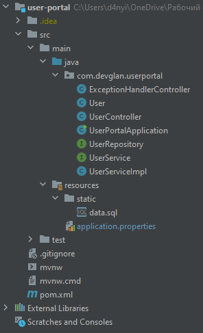
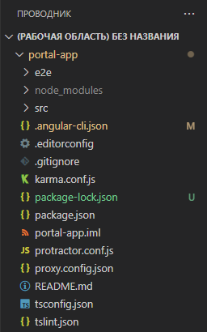
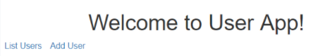
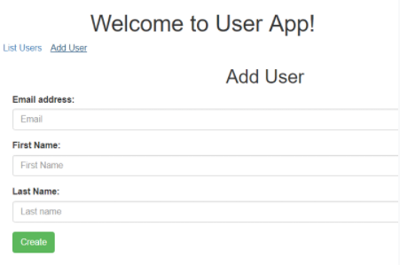
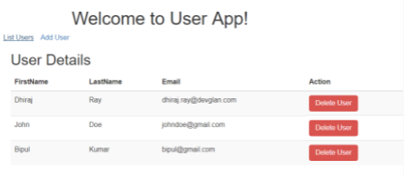

= Отчет по лабораторной работе 7
Студента группы ПИМ-21 Петров Д.Д.
:figure-caption: Рисунок
:listing-caption: Листинг
:source-highlighter: coderay

== 1 Постановка задачи
В процессе выполнения лабораторной работы необходимо выполнить следующие задачи:

. Сделать форму для ввода данных,с которой будет отправляться http запрос на сервер.

== 2 Выполнение

=== 2.1 Структура проекта

.Структура проекта

.user-portal

.portal-app

=== 2.2 Задание

Для реализации и последующего тестирования будем использовать фреймворк Angular. Angular предоставляет инструмент Angular CLI для начала работы с проектом. Мы будем использовать Angular CLI чтобы сгенерировать образец приложения angular, а затем изменим его в соответствии с нашими дальнейшими требованиями. Структура сгенерированного проекта продемонстрирована на скриншоте №2.

.Листинг класса UserController для работы GRUD.
[source, java]
----
package com.devglan.userportal;

import org.springframework.beans.factory.annotation.Autowired;
import org.springframework.web.bind.annotation.*;

import java.util.List;

@CrossOrigin(origins = "http://localhost:4200", maxAge = 3600)
@RestController
@RequestMapping({"/api"})
public class UserController {

    @Autowired
    private UserService userService;

    @PostMapping
    public User create(@RequestBody User user){
        return userService.create(user);
    }

    @GetMapping(path = {"/{id}"})
    public User findOne(@PathVariable("id") int id){
        return userService.findById(id);
    }

    @PutMapping
    public User update(@RequestBody User user){
        return userService.update(user);
    }

    @DeleteMapping(path ={"/{id}"})
    public User delete(@PathVariable("id") int id) {
        return userService.delete(id);
    }

    @GetMapping
    public List findAll(){
        return userService.findAll();
    }
}
----

.Скрипт на создание юзера в базе данных.
[source, java]
----
create table user (id integer not null auto_increment, email varchar(255), first_name varchar(255), last_name varchar(255), primary key (id))
----

.Листинг класса User.
[source, java]
----
package com.devglan.userportal;

import javax.persistence.*;

@Entity
@Table(name = "user")
public class User {

    @Id
    @Column
    @GeneratedValue(strategy = GenerationType.IDENTITY)
    private int id;
    @Column
    private String firstName;
    @Column
    private String lastName;
    @Column
    private String email;

    public int getId() {
        return id;
    }

    public void setId(int id) {
        this.id = id;
    }

    public String getFirstName() {
        return firstName;
    }

    public void setFirstName(String firstName) {
        this.firstName = firstName;
    }

    public String getLastName() {
        return lastName;
    }

    public void setLastName(String lastName) {
        this.lastName = lastName;
    }

    public String getEmail() {
        return email;
    }

    public void setEmail(String email) {
        this.email = email;
    }
}
----

.Листинг user.model.ts.
[source, java]
----
export class User {

  id: string;
  firstName: string;
  lastName: string;
  email: string;
}
----

.Листинг user.compnent.ts
[source, java]
----
import { Component, OnInit } from '@angular/core';
import { Router } from '@angular/router';

import { User } from '../models/user.model';
import { UserService } from './user.service';

@Component({
  selector: 'app-user',
  templateUrl: './user.component.html',
  styles: []
})
export class UserComponent implements OnInit {

  users: User[];

  constructor(private router: Router, private userService: UserService) {

  }

  ngOnInit() {
    this.userService.getUsers()
      .subscribe( data => {
        this.users = data;
      });
  };

  deleteUser(user: User): void {
    this.userService.deleteUser(user)
      .subscribe( data => {
        this.users = this.users.filter(u => u !== user);
      })
  };

}
----

.Листинг user.service.ts
[source, java]
----
import {Injectable} from '@angular/core';
import { HttpClient, HttpHeaders } from '@angular/common/http';

import { User } from '../models/user.model';

const httpOptions = {
  headers: new HttpHeaders({ 'Content-Type': 'application/json' })
};

@Injectable()
export class UserService {

  constructor(private http:HttpClient) {}

  //private userUrl = 'http://localhost:8080/user-portal/user';
	private userUrl = '/api';

  public getUsers() {
    return this.http.get<User[]>(this.userUrl);
  }

  public deleteUser(user) {
    return this.http.delete(this.userUrl + "/"+ user.id);
  }

  public createUser(user) {
    return this.http.post<User>(this.userUrl, user);
  }

}
----

== 3 Результаты выполнения

.Главная страница http://localhost:4200/

.Форма для добавления пользователя

.Просмотр всех пользователей с возможностью удаления

== Вывод
В результате выполнения лабораторной работы, были созданы и протестированы компоненты при помощи фреймворка angular. Было реализовано 3 операции над сущностью User - удаление, показ всех пользователей и добавление пользователя.
